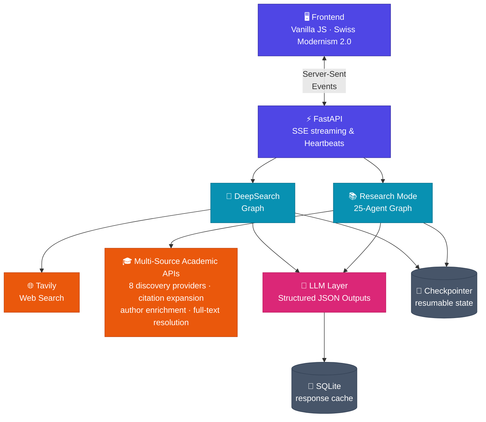
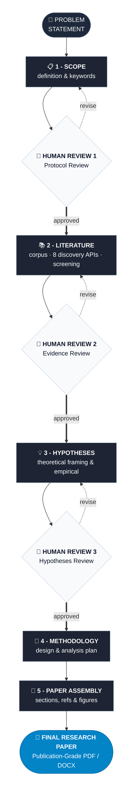

#  DeepResearch

[](LICENSE)     

[](https://deep-research-ai-xi.vercel.app/)   [](https://github.com/Aryan-Pardeshi/DeepResearch_AI/stargazers) 

An AI-powered multi-agent research workspace with **two modes**: fast web research that returns a cited report, and a full evidence-grounded academic pipeline that writes complete, citation-verified research papers with human-in-the-loop quality gates.

**🔗 Live demo → [deep-research-ai-xi.vercel.app](https://deep-research-ai-xi.vercel.app/)**

---

## Two Modes

| | **DeepSearch** | **Research Mode (Evidence-First)** |
|---|---|---|
| **Goal** | Answer a question from the live web | Write a full, evidence-grounded academic paper |
| **Sources** | Tavily web search | OpenAlex · Semantic Scholar · Crossref · PubMed · arXiv · Europe PMC · DOAJ · DataCite · OpenCitations |
| **Agents** | 5 (fan-out parallel researchers) | 25 specialized agents across 5 evidence phases |
| **HITL Checkpoints** | 1 (plan approval) | 3 Quality Gates (Protocol, Evidence Corpus, Hypotheses) |
| **Data Invariant** | LLM web summary | Deterministic `EvidenceRecord` store (quotes, metrics, baselines) |
| **PRISMA Tracking** | N/A | Deterministic PRISMA 2020 flow counts & assertions |
| **Integrity Audit** | Citation regex | Automated citation & numerical claim grounding verification |
| **Runtime** | ~1-2 min | ~5-15 min |
| **Output** | Structured markdown report | Full paper + PRISMA flow chart + evidence mapping matrix |
| **Export** | `.md` | `.pdf` · `.docx` |

---

## Architecture

Both modes run as separate LangGraph state machines behind one FastAPI backend, sharing the LLM layer, checkpointer, and SSE streaming transport.



---

## 25-Agent Evidence-First Research Pipeline



---

## 3 Human-in-the-Loop Quality Gates

Each gate genuinely pauses graph execution via LangGraph `interrupt()`, allowing the author to approve or request targeted revisions in natural language:

| Gate | Phase | Review Artifacts | Guarantees |
|---|---|---|---|
| **Gate 1: Planning & Protocol** | Phase 1 | PICOC Protocol, Objectives, Research Questions, Boolean Keywords | Prevents query divergence before initiating multi-source retrieval |
| **Gate 2: Evidence & Corpus** | Phase 3 | PRISMA Flow Tracker, Screened Literature, Extracted Evidence Records | Verifies empirical grounding before theoretical synthesis begins |
| **Gate 3: Hypotheses & Framework** | Phase 4 | Conceptual Framework, Research Gaps, Formulated Hypotheses (H1..H5) | Confirms theoretical validity before committing to full paper generation |

---

## Academic Integrity & Research Invariants

1. **Deterministic Flow-Tracking State Machine (PRISMA 2020-aligned)**:
   `PRISMATracker.validate_invariants()` asserts these *internal* conservation relations:
   ```python
   records_identified - duplicates_removed     == records_after_dedup
   records_screened   - excluded_title_abstract == full_text_requested
   full_text_assessed - excluded_full_text      == studies_included
   ```
   `full_text_requested` is the tracker's internal shortcut for PRISMA's *reports sought for retrieval*. The distinct PRISMA stages *reports not retrieved* (`full_text_unavailable`) and *reports assessed for eligibility* (`full_text_assessed`) are tracked as separate fields, but the hand-off between them is not asserted—so the equations above are internal invariants rather than the complete PRISMA 2020 flow. Every count is tracked deterministically in code—never generated or estimated by an LLM.

2. **Immutable Evidence Store**:
   - `PaperRecord.paper_id`: first 16 hex characters of a SHA-256 digest (a truncated representation, not the full digest) computed over a source-qualified key: `doi:<canonicalized DOI>` when a DOI is available, otherwise `title:<normalized title>:<year>`. Normalized titles are not assumed unique, so the fallback key also folds in the publication year (`nd` when unknown).
   - `EvidenceRecord.evidence_id`: deterministic composite identifier `{paper_id}_ev001` (the composite is not itself hashed) anchoring exact quote, metric, baseline value, and effect direction.
   - `ReviewClaim.claim_id`: deterministic composite identifier `{section}_cl001` (section slug truncated to 8 characters) linking paper claims to supporting evidence IDs.

3. **Deterministic Validation Pipeline**:
   - `citation_validator`: Audits every in-text citation against known `PaperRecord` metadata; flags unverified or hallucinated citations.
   - `claim_validator`: Audits quantitative sentences against extracted `EvidenceRecord` benchmark metrics.
   - `integrity_auditor`: Validates PRISMA invariants and issues comprehensive `ValidationReport`.

---

## Tech Stack

| Layer | Technology |
|---|---|
| **Orchestration** | LangGraph (StateGraph, `interrupt()` HITL, `Send()` fan-out, SQLite persistence) |
| **Structured LLM** | Pydantic v2 schemas + `ainvoke_structured_with_retry` |
| **Academic Sources** | OpenAlex, Semantic Scholar, Crossref, PubMed, arXiv, Europe PMC, DOAJ, DataCite, OpenCitations |
| **Author Enrichment** | Optional ORCID author-name canonicalization |
| **Full-Text Ingestion** | Unpaywall → Europe PMC → CORE fallback chain |
| **Backend API** | FastAPI + Server-Sent Events (SSE) with keep-alive heartbeats |
| **Frontend UI/UX** | Vanilla JS + CSS (Swiss Modernism 2.0, zero-build, responsive) |
| **Figures & Charts** | matplotlib (PRISMA 2020 Flowchart, Hypothesis Evidence Matrix) |
| **Document Export** | FPDF2 (`.pdf` with hanging APA indents) · python-docx (`.docx`) |

---

## Academic API coverage

Research Mode uses each academic API for a specific stage:

| API | Role | Configuration |
|---|---|---|
| **OpenAlex** | Literature discovery and open-access metadata | `OPENALEX_EMAIL` |
| **Semantic Scholar** | Literature discovery and citation metadata | Optional `SEMANTIC_SCHOLAR_API_KEY` |
| **Crossref** | Literature discovery and DOI metadata resolution | Uses `OPENALEX_EMAIL` for polite-pool requests |
| **PubMed (NCBI E-utilities)** | Biomedical literature discovery | `NCBI_EMAIL` and `NCBI_TOOL_NAME`; optional `NCBI_API_KEY` |
| **arXiv** | Preprint discovery | No credentials |
| **Europe PMC** | Biomedical discovery and full-text fallback | No credentials |
| **Directory of Open Access Journals (DOAJ)** | Open-access journal discovery | No credentials |
| **DataCite** | Research-output and dataset discovery | No credentials |
| **OpenCitations** | Forward and backward citation-graph expansion | No credentials |
| **ORCID** | Optional author identity enrichment | Set `ORCID_AUTHOR_ENRICHMENT=1` |
| **Unpaywall** | Open-access PDF resolution | Uses `OPENALEX_EMAIL` |
| **CORE** | Optional full-text fallback | Optional `CORE_API_KEY` |

---

## Getting Started

### 1. Clone & Configure

```bash
git clone https://github.com/Aryan-Pardeshi/DeepResearch_AI.git
cd DeepResearch_AI
cp .env.example .env
```

Minimum `.env` configuration:

```bash
LLM_API_KEY="your_api_key_here"
LLM_BASE_URL="https://api.deepseek.com"
TAVILY_API_KEY="your_tavily_key_here"
OPENALEX_EMAIL="you@example.com"
NCBI_EMAIL="you@example.com"
NCBI_TOOL_NAME="your_tool_name"
```

Optional academic API configuration:

```bash
SEMANTIC_SCHOLAR_API_KEY="your_api_key_here"
NCBI_API_KEY="your_api_key_here"
CORE_API_KEY="your_api_key_here"
ORCID_AUTHOR_ENRICHMENT=0
```

### 2. Run with Docker

```bash
docker compose up -d --build
```

Access the UI at **[http://localhost:8000](http://localhost:8000)**.

### 3. Local Development

```bash
python -m venv .venv
.venv\Scripts\activate      # Windows (or source .venv/bin/activate on Unix)
pip install -r requirements.txt
uvicorn backend.app.main:app --reload --port 8000
```

---

## Author

Built by [Aryan Pardeshi](https://github.com/Aryan-Pardeshi) — open to AI/ML internship opportunities.

Connect: [LinkedIn](https://linkedin.com/in/aryan-pardeshi-dev) · [GitHub](https://github.com/Aryan-Pardeshi)
