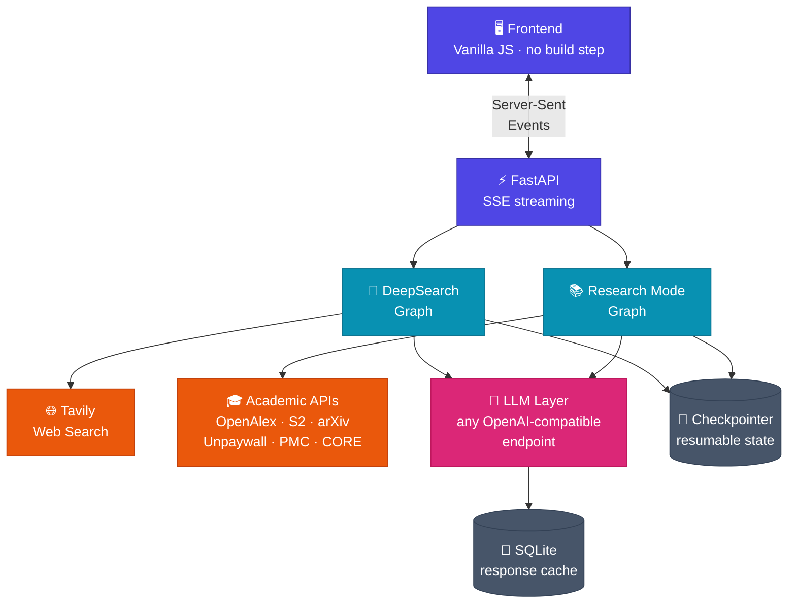
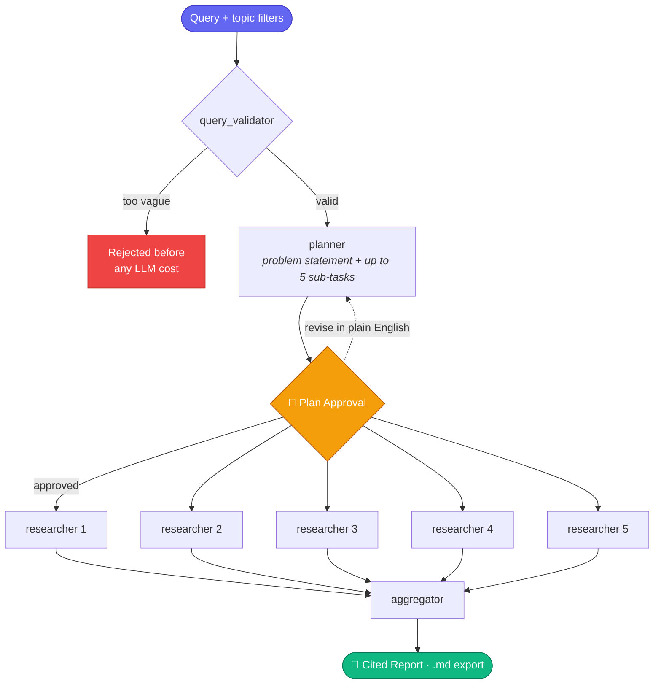
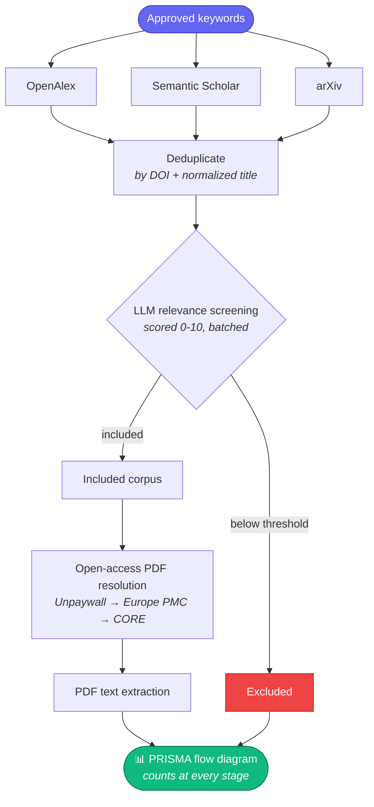

#  DeepResearch

An AI-powered multi-agent research workspace with **two modes**: fast web research that returns a cited report, and a full academic pipeline that writes a complete, citation-verified research paper with human-in-the-loop approval at every major decision.

**🔗 Live demo → [deepresearch-ai-gxiu.onrender.com](https://deep-research-ai-xi.vercel.app/)**


---

## Two Modes

| | **DeepSearch** | **Research Mode** |
|---|---|---|
| **Goal** | Answer a question from the live web | Write a full academic paper |
| **Sources** | Tavily web search | OpenAlex · Semantic Scholar · arXiv |
| **Agents** | 5 (fan-out researchers) | 25 across 8 phases |
| **HITL checkpoints** | 1 (plan approval) | 4 (scope, framework, hypotheses, methodology) |
| **Runtime** | ~1-2 min | ~10-25 min |
| **Output** | Structured markdown report | Paper + PRISMA diagram + evidence matrix |
| **Export** | `.md` | `.pdf` · `.docx` |

---

## Architecture

Both modes run as separate LangGraph state machines behind one FastAPI backend, sharing the LLM layer, checkpointer, and SSE streaming transport.



---

## DeepSearch Mode

Web research with a plan you approve before anything runs.



**How it works**

1. Submit a query with optional topic filters (News, Academic, Finance, Patents)
2. A **Validator** rejects vague queries before spending a single token
3. A **Planner** generates a problem statement plus up to 5 independent sub-tasks
4. You approve the plan, or request revisions in plain English — it loops until you're happy
5. Up to 5 **Researchers** fan out in parallel via LangGraph's `Send()` API
6. An **Aggregator** synthesizes every finding into one structured markdown report

---

## Research Mode

A 25-agent academic pipeline. You steer it at four checkpoints; it does everything else.

```mermaid
flowchart TB
    subgraph L1 ["Phase 1 & 2 · Scope & Literature Review"]
        direction LR
        START(["Problem Statement"]) --> SCOPE["<b>1 · Scope</b><br/>definition & keywords"]
        SCOPE --> CP1{"🧑 Checkpoint 1"}
        CP1 -.->|"revise"| SCOPE
        CP1 -->|"approved"| CORPUS["<b>2 · Literature</b><br/>corpus, review & framework"]
        CORPUS --> CP2{"🧑 Checkpoint 2"}
        CP2 -.->|"revise"| CORPUS
    end

    subgraph L2 ["Phase 3 to 5 · Hypotheses, Methodology & Paper Assembly"]
        direction LR
        HYP["<b>3 · Hypotheses</b><br/>theoretical & empirical"] --> CP3{"🧑 Checkpoint 3"}
        CP3 -.->|"revise"| HYP
        CP3 -->|"approved"| METH["<b>4 · Methodology</b><br/>design & analysis plan"]
        METH --> CP4{"🧑 Checkpoint 4"}
        CP4 -.->|"revise"| METH
        CP4 -->|"approved"| WRITE["<b>5 · Paper Assembly</b><br/>sections, refs & figures"]
        WRITE --> DONE(["📄 Complete Paper · PDF · DOCX"])
    end

    style START fill:#6366f1,stroke:#4338ca,color:#fff
    style CP1 fill:#f59e0b,stroke:#b45309,color:#fff
    style CP2 fill:#f59e0b,stroke:#b45309,color:#fff
    style CP3 fill:#f59e0b,stroke:#b45309,color:#fff
    style CP4 fill:#f59e0b,stroke:#b45309,color:#fff
    style DONE fill:#10b981,stroke:#047857,color:#fff
    style L1 fill:none,stroke:#64748b,stroke-width:1px,stroke-dasharray: 4 4
    style L2 fill:none,stroke:#64748b,stroke-width:1px,stroke-dasharray: 4 4
```



**The four checkpoints** — each pauses the graph via LangGraph `interrupt()`, so nothing downstream runs until you say so. Reject one and the LLM revises from your feedback in natural language.

| # | You review | Before it commits to |
|---|---|---|
| **1** | Problem statement, objectives, research questions, keywords | Fetching hundreds of papers |
| **2** | Literature review, research gap, conceptual framework | Generating hypotheses |
| **3** | Proposed hypotheses | Formulating methodology |
| **4** | Research design, data collection, analysis plan | Writing the full paper |

### Corpus pipeline



Every stage is counted and rendered into a **PRISMA flow diagram** — the standard systematic-review figure showing identification, screening, and inclusion at each step.

---

## Tech Stack

| Layer | Technology |
|---|---|
| Agent graphs | LangGraph — `interrupt()` HITL, `Send()` fan-out, checkpointer persistence |
| LLM | Any OpenAI-compatible endpoint (DeepSeek by default), per-role model config |
| LLM caching | SQLite response cache — identical prompts never billed twice |
| Web search | Tavily API |
| Academic sources | OpenAlex, Semantic Scholar, arXiv |
| Full-text recovery | Unpaywall → Europe PMC → CORE fallback chain |
| Backend | FastAPI + Server-Sent Events |
| Frontend | Vanilla JS + CSS — no framework, no bundler, no build step |
| Figures | matplotlib (PRISMA diagram, evidence matrix) |
| Export | FPDF2 (`.pdf`), python-docx (`.docx`) |
| Deploy | Docker · single container · Render / HF Spaces |

---

## Features

**Both modes**

- **Human-in-the-Loop** — approve or revise in natural language; the graph genuinely pauses via `interrupt()`
- **Real-time SSE streaming** — live agent progress, token-by-token writing
- **Session persistence** — close the tab mid-run, come back, pick up exactly where you left off
- **Resumable graph state** — checkpointed to SQLite, survives a backend restart
- **Bring your own model** — point `LLM_BASE_URL` at any OpenAI-compatible gateway
- **Dark/Light mode** with persistent preference

**Research Mode**

- **Sources library panel** — every screened paper, sorted by relevance, one click to full metadata
- **Evidence strip at Checkpoint 2** — see the actual papers behind the literature review, not just its conclusions
- **Inline citation links** — `(Author, 2024)` in the paper body opens that exact source
- **Citation verification** — a dedicated agent checks claims against the retrieved corpus
- **PRISMA flow diagram** + **evidence matrix** auto-generated as figures
- **PDF and DOCX export** with real heading hierarchy, lists, and formatting

---

## Project Structure

```
research-bot/
├── backend/
│   └── app/
│       ├── agents/
│       │   ├── planner.py, researcher.py, aggregator.py    # DeepSearch
│       │   ├── supervisor.py, query_validator.py
│       │   └── research_mode/agents.py                     # all 25 RM agents
│       ├── api/
│       │   ├── agent.py                                    # DeepSearch routes
│       │   └── research_mode.py                            # Research Mode routes
│       ├── graph/
│       │   ├── builder.py, state.py                        # DeepSearch graph
│       │   └── research_mode_builder.py, research_mode_state.py
│       ├── tools/
│       │   ├── tavily_search.py                            # web search
│       │   ├── academic_search.py                          # OpenAlex/S2/arXiv
│       │   ├── oa_resolver.py, fulltext_fetcher.py         # open-access PDFs
│       │   ├── figures.py                                  # PRISMA + evidence table
│       │   └── pdf_generator.py, docx_generator.py         # export
│       ├── llm.py                                          # model config + cache
│       └── main.py                                         # app + static serving
├── frontend/                                               # index.html, app.js, style.css
├── tests/
├── docker-compose.yml
├── Dockerfile
├── requirements.txt
└── .env.example
```

---

## Getting Started

### Prerequisites

- Docker + Docker Compose
- An LLM API key — [DeepSeek](https://platform.deepseek.com) is the default and cheapest, but any OpenAI-compatible endpoint works
- [Tavily](https://tavily.com) API key — DeepSearch mode only

### 1. Clone

```bash
git clone https://github.com/Aryan-Pardeshi/DeepResearch_AI.git
```

### 2. Configure

```bash
cd DeepResearch_AI/research-bot && cp .env.example .env
```

Minimum viable `.env`:

```bash
LLM_API_KEY="your_key_here"
LLM_BASE_URL="https://api.deepseek.com"
TAVILY_API_KEY="your_key_here"
OPENALEX_EMAIL="you@example.com"
```

> `OPENALEX_EMAIL` needs a real address — OpenAlex and Unpaywall require it for their polite pool. Without it you get heavily rate-limited.

Optional but useful: `SEMANTIC_SCHOLAR_API_KEY` (higher rate limit), `CORE_API_KEY` (free, recovers extra open-access full texts).

### 3. Run

```bash
docker compose up -d --build
```

App → **[http://localhost:8000](http://localhost:8000)** — one container serves both the API and the UI.

---

### Local Development (without Docker)

```bash
cd research-bot && pip install -r requirements.txt && uvicorn backend.app.main:app --reload --port 8000
```

The frontend is served from the same origin at `/`, so no separate server and no CORS setup. Edit `frontend/*` and hard-refresh — no build step.

---

## API Endpoints

**DeepSearch**

| Method | Endpoint | Description |
|---|---|---|
| `POST` | `/research/start` | Validate query, generate problem statement + plan |
| `POST` | `/research/approve` | Resume graph, stream SSE events |
| `GET` | `/research/result/{thread_id}` | Fetch report by thread |
| `POST` | `/research/cancel` | Cancel an in-flight run |

**Research Mode**

| Method | Endpoint | Description |
|---|---|---|
| `POST` | `/research-mode/start` | Define scope, run to Checkpoint 1 |
| `POST` | `/research-mode/approve` | Approve/revise a checkpoint, stream SSE |
| `GET` | `/research-mode/result/{thread_id}` | Full graph state + checkpoint status |
| `POST` | `/research-mode/export/{thread_id}` | Export paper as PDF |
| `POST` | `/research-mode/export/docx/{thread_id}` | Export paper as DOCX |

**System**

| Method | Endpoint | Description |
|---|---|---|
| `GET` | `/healthz` | Liveness probe |
| `GET` | `/config/status` | Which keys are configured (never returns values) |
| `POST` | `/config/setup` | Update config — auth-gated, fails closed |

> `/config/setup` can rewrite `LLM_API_KEY` and `LLM_BASE_URL`, so it is **disabled by default**. Set `CONFIG_API_TOKEN` to enable it behind an `X-Config-Token` header, or `ALLOW_OPEN_CONFIG_API=1` for local development only. Never enable the latter on a public URL.

---

## Author

Built by [Aryan Pardeshi](https://github.com/Aryan-Pardeshi) — open to AI/ML internship opportunities.

Connect: [LinkedIn](https://linkedin.com/in/aryan-pardeshi-dev) · [GitHub](https://github.com/Aryan-Pardeshi)
